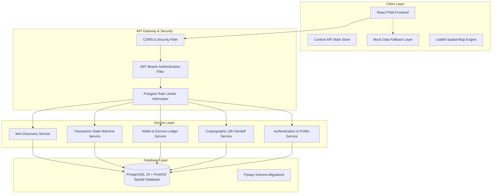
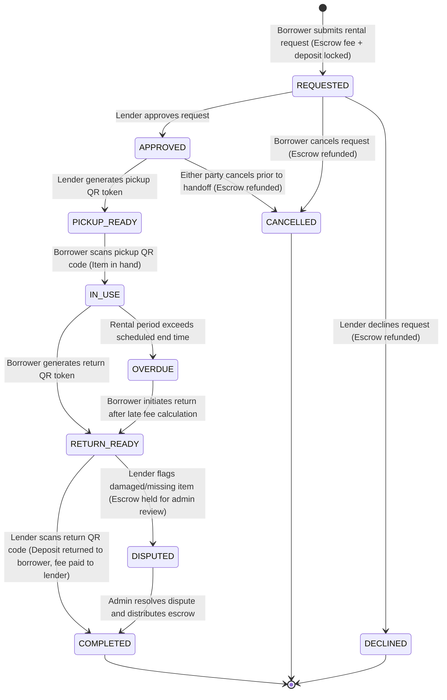
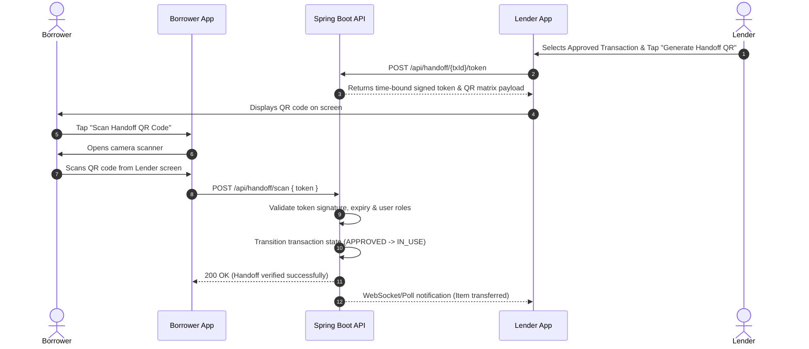
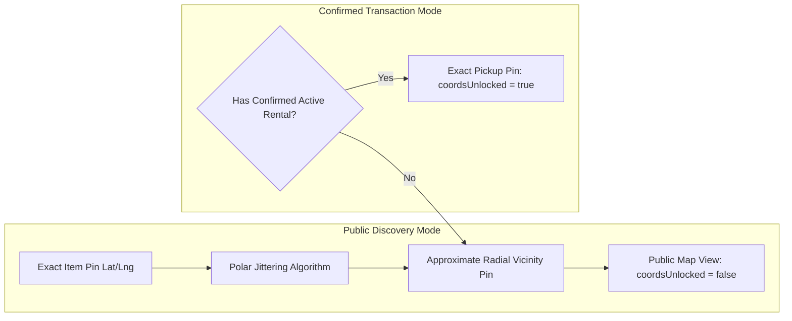

# Telos — Hyperlocal Peer-to-Peer Sharing Economy Platform

Telos is a full-stack, enterprise-grade peer-to-peer (PWA) sharing platform designed to facilitate secure borrowing, renting, and sharing of tools, cameras, camping equipment, and household gear among verified neighbors within a customizable radial geographic boundary.

The system combines a reactive Progressive Web Application frontend with a Spring Boot and PostGIS spatial database backend, enforcing atomic financial escrow holds, server-authoritative transaction state transitions, time-bound cryptographic QR code handoffs, and strict coordinate privacy protection.

---

## Key Platform Capabilities

1. **Hyperlocal Radial Spatial Discovery**
   Real-time geospatial radius filtering powered by PostGIS `ST_DWithin` spatial calculations. Users can discover nearby listings within configurable neighborhood distances ranging from 500 meters to 25 kilometers.

2. **Server-Authoritative Coordinate Privacy**
   Exact pickup coordinates are obscured by default using a deterministic polar-coordinate jittering algorithm. Exact pickup pins are unlocked strictly when a transaction reaches an approved state between confirmed parties.

3. **Atomic Wallet & Financial Escrow System**
   Automated escrow hold lifecycle supporting Indian Rupee (₹) currency calculations. Rental fees and refundable security deposits are atomically locked upon reservation request and safely settled or refunded upon verified return.

4. **Authoritative Transaction State Machine**
   Finite state machine governing item lifecycle transitions. Requests move strictly through validated states with server-side validation preventing race conditions or invalid state progressions.

5. **Cryptographic QR Code Handoff Verification**
   Dual-confirmation physical handoffs using short-lived, cryptographically signed handoff tokens. Both pickup and return events require physical scanning and verification before escrow release.

6. **Cross-Platform Progressive Web Application**
   Responsive UI supporting touch-native navigation, dark and light theme switching, full-screen PWA standalone desktop/mobile installation, and interactive Leaflet map integration.

---

## System Architecture



---

## Transaction Escrow State Machine



---

## Physical QR Code Handoff Sequence Flow



---

## Coordinate Privacy Model



---

## Technology Stack

| Layer | Component | Version | Description |
| --- | --- | --- | --- |
| **Frontend Framework** | React | 18.3.1 | Single Page Application framework with hooks and functional components |
| **Build Tooling** | Vite | 5.4.21 | Hot Module Replacement build engine and bundler |
| **Styling & Design** | Tailwind CSS | 3.4.17 | Utility-first CSS framework with custom design tokens |
| **Animations** | Framer Motion | 12.4.7 | Micro-animations, page transitions, and modal gestures |
| **Geospatial Mapping** | Leaflet / React-Leaflet | 1.9.4 / 4.2.1 | Client-side interactive map rendering engine |
| **Iconography** | Lucide React | 0.475.0 | Vector UI iconography library |
| **Backend Framework** | Spring Boot | 3.3.5 | Java REST API framework with Spring Web and Security |
| **Runtime Environment** | Java OpenJDK | 17.0.0 | Long-Term Support Java runtime |
| **Database Engine** | PostgreSQL | 16.0 | Relational database engine |
| **Spatial Extension** | PostGIS | 3.5.0 | Geographic spatial queries and ST_DWithin distance calculations |
| **ORM & Persistence** | Hibernate Spatial / JPA | 6.5.3 | Object-relational mapping for Spatial Geography types |
| **Database Migrations** | Flyway | 10.10.0 | Database schema versioning and initial data seeds |

---

## Core REST API Endpoints

### 1. Authentication & User Profile

| Method | Endpoint | Access | Description |
| --- | --- | --- | --- |
| `POST` | `/api/auth/login` | Public | Authenticates user credentials and issues JWT token |
| `POST` | `/api/auth/signup` | Public | Registers a new user account with home neighborhood |
| `GET` | `/api/me` | Authenticated | Returns current authenticated user profile and wallet status |
| `GET` | `/api/users/{id}` | Authenticated | Fetches public profile and rating history for a specific neighbor |

### 2. Item Catalog & Radial Discovery

| Method | Endpoint | Access | Description |
| --- | --- | --- | --- |
| `GET` | `/api/items` | Public | Queries nearby items filtered by radius, category, mode, and price |
| `GET` | `/api/items/{id}` | Public | Fetches item detail, specifications, and conditional coordinate lock |
| `POST` | `/api/items` | Authenticated | Creates a new P2P item listing with price and deposit requirements |
| `GET` | `/api/categories` | Public | Retrieves predefined catalog categories |

### 3. Transaction Management & Escrow

| Method | Endpoint | Access | Description |
| --- | --- | --- | --- |
| `GET` | `/api/transactions` | Authenticated | Lists active and historical borrowing/lending transactions |
| `POST` | `/api/transactions` | Authenticated | Submits a rental request and locks wallet funds in escrow |
| `PATCH` | `/api/transactions/{id}` | Authenticated | Executes state transitions (APPROVE, DECLINE, CANCEL, DISPUTE) |

### 4. Wallet & Ledger Operations

| Method | Endpoint | Access | Description |
| --- | --- | --- | --- |
| `GET` | `/api/wallet` | Authenticated | Retrieves available, locked escrow, and earned balances in Rupee (₹) |
| `POST` | `/api/wallet/topups` | Authenticated | Adds funds to user wallet using mock payment methods |
| `GET` | `/api/wallet/ledger` | Authenticated | Lists financial audit log entries for all credit/debit events |

### 5. Cryptographic QR Handoff Engine

| Method | Endpoint | Access | Description |
| --- | --- | --- | --- |
| `POST` | `/api/handoff/{txId}/token` | Authenticated | Generates a time-bound signed QR token for pickup or return |
| `POST` | `/api/handoff/scan` | Authenticated | Scans and verifies a QR handoff token to advance transaction state |

### 6. Administration & Identity Verification

| Method | Endpoint | Access | Description |
| --- | --- | --- | --- |
| `GET` | `/api/admin/verifications` | Admin Only | Fetches pending KYC identity and receipt verification requests |
| `PATCH` | `/api/admin/verifications/{id}` | Admin Only | Approves or rejects user identity and receipt submissions |

---

## Transaction State Transition Matrix

| Current State | Action | Next State | Escrow Funds Movement | Authorized Roles |
| --- | --- | --- | --- | --- |
| `None` | `SUBMIT_REQUEST` | `REQUESTED` | Lock `rental_fee + deposit` from Borrower Available to Locked | Borrower |
| `REQUESTED` | `APPROVE` | `APPROVED` | Funds remain locked in escrow | Lender |
| `REQUESTED` | `DECLINE` | `DECLINED` | Unlock full amount back to Borrower Available | Lender |
| `REQUESTED` | `CANCEL` | `CANCELLED` | Unlock full amount back to Borrower Available | Borrower |
| `APPROVED` | `CANCEL` | `CANCELLED` | Unlock full amount back to Borrower Available | Borrower / Lender |
| `APPROVED` | `SCAN_PICKUP_QR` | `IN_USE` | Funds remain locked in escrow | Borrower (Scanner) |
| `IN_USE` | `SCAN_RETURN_QR` | `COMPLETED` | Return deposit to Borrower; payout rental fee to Lender | Lender (Scanner) |
| `IN_USE` | `RAISE_DISPUTE` | `DISPUTED` | Escrow held until admin resolution | Borrower / Lender |
| `DISPUTED` | `ADMIN_RESOLVE` | `COMPLETED` | Custom distribution based on dispute decision | Admin |

---

## Environment Configuration Matrix

| Variable | Default Value | Required in Production | Purpose |
| --- | --- | --- | --- |
| `TELOS_PORT` | `8080` | No | Port on which the Spring Boot application listens |
| `TELOS_DB_URL` | `jdbc:postgresql://localhost:5433/telos` | Yes | JDBC spatial database connection string |
| `TELOS_DB_USER` | `telos` | Yes | PostgreSQL user credentials |
| `TELOS_DB_PASSWORD` | `telos` | Yes | PostgreSQL password credentials |
| `TELOS_JWT_SECRET` | `dev-jwt-secret-key-must-be-changed-in-production-environment` | Yes | HMAC-SHA256 signing secret for authentication tokens |
| `TELOS_CORS_ORIGINS` | `http://localhost:5173,http://localhost:4173` | Yes | Permitted cross-origin resource sharing origins |

---

## Seeded Demo Persona Credentials

All pre-seeded demo accounts use the standard password `demo1234`.

| User ID | Full Name | Email Address | Neighborhood Role | Default Rating |
| --- | --- | --- | --- | --- |
| `u-001` | Aliya Rahman | `aliya.rahman@telos.app` | HSR Layout Sector 1 (Admin & Lender) | 4.9 (24 reviews) |
| `u-002` | Vikram Malhotra | `vikram.malhotra@telos.app` | Koramangala 4th Block (Lender) | 4.8 (18 reviews) |
| `u-003` | Ananya Iyer | `ananya.iyer@telos.app` | Indiranagar 100ft Road (Borrower) | 4.7 (11 reviews) |

---

## Local Setup & Development Instructions

### 1. Prerequisites
Ensure the following tools are installed on your development environment:
- Node.js (version 18.0 or higher) and npm
- Java OpenJDK 17
- Apache Maven 3.9+
- PostgreSQL 16 with PostGIS extension enabled

### 2. Frontend PWA Setup
Navigate to the frontend directory and install dependencies:

```bash
cd frontend
npm install
npm run dev
```
The application will start on `http://localhost:5173`.

### 3. Frontend Production Build Verification
To test the production asset compilation:

```bash
cd frontend
npm run build
```

### 4. Backend Service Setup
Create the PostGIS database instance and run migrations:

```bash
# Initialize PostgreSQL database
createdb -h localhost -p 5433 -U postgres -O telos telos
psql -h localhost -p 5433 -U postgres -d telos -c "CREATE EXTENSION IF NOT EXISTS postgis;"

# Launch Spring Boot backend
mvn spring-boot:run
```

### 5. Automated System Verification
Execute the automated lifecycle smoke test script to verify all REST endpoints:

```bash
bash smoke-test.sh
```

---

## Licensing & Governance

This project is distributed under the MIT Open Source License. All rights reserved.
