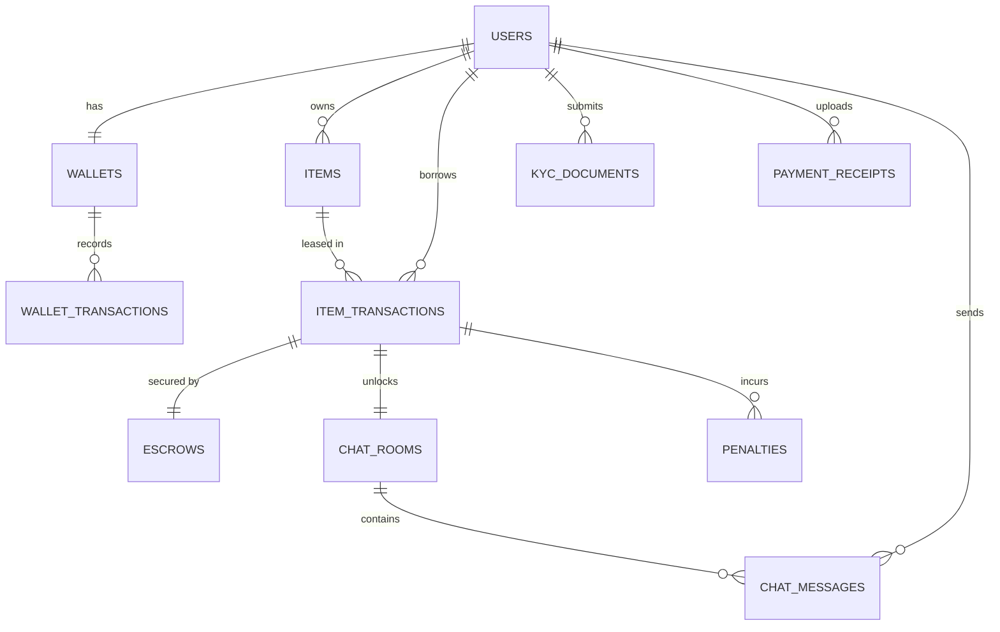

# Telos Database Documentation

This document outlines the complete database design, schemas, and entity relationships for **Telos**, a hyperlocal peer-to-peer (P2P) sharing economy platform.

The database architecture is designed to support high-performance spatial queries (for radial proximity search and coordinate obfuscation), secure multi-split wallet ledgers, virtual escrows, cryptographic QR codes, and state-machine transitions.

---

## 1. Entity-Relationship Diagram (ERD)

The following Mermaid diagram shows the entities and their relationships.

---

## 2. State Machine Lifecycle

Items and transactions in Telos follow a strict, enum-driven lifecycle to enforce zero-trust security and ensure physical handoffs are cryptographically validated.

```mermaid
stateDiagram-v2
    [*] --> AVAILABLE : Item listed by owner with location & pricing

    AVAILABLE --> REQUESTED : Borrower requests item; funds locked in Escrow
    
    REQUESTED --> APPROVED : Lender accepts request; exact coordinates & chat unlocked
    REQUESTED --> AVAILABLE : Lender rejects / Borrower cancels; funds returned

    APPROVED --> ACTIVE : Pickup QR code scanned; item handed over
    APPROVED --> AVAILABLE : Request expires / cancelled before handoff; funds returned

    ACTIVE --> RETURNED : Return QR code scanned; escrow released to respective wallets
    ACTIVE --> OVERDUE : Due date passes without return; daily cron triggers penalty calculations

    OVERDUE --> RETURNED : Return QR code scanned; outstanding penalties deducted from deposit
```

---

## 3. Database Schema Definitions

### 3.1. `users` Table
Stores user profile information. Authentication is delegated to Firebase Auth.

| Column Name | Data Type | Key Type | Description |
| :--- | :--- | :--- | :--- |
| `id` | `UUID` | `PK` | Unique identifier for the user. |
| `firebase_uid` | `VARCHAR` | `Unique` | Firebase Authentication UID mapping. |
| `email` | `VARCHAR` | `Unique` | User email address. |
| `display_name` | `VARCHAR` | - | User's public display name. |
| `avatar_url` | `VARCHAR` | - | Link to user profile image. |
| `location` | `Point (Spatial)`| - | Spatial coordinates (latitude & longitude) for radial lookup queries. |
| `kyc_status` | `VARCHAR` | - | KYC status check (e.g. `NOT_SUBMITTED`, `PENDING`, `VERIFIED`, `REJECTED`). |
| `created_at` | `TIMESTAMP` | - | Record creation timestamp. |
| `updated_at` | `TIMESTAMP` | - | Record modification timestamp. |

> [!NOTE]
> **Coordinate Obfuscation**: The exact coordinates in the `location` column are obfuscated on the frontend for non-approved transactions, showing only a randomized 2km-5km bounding area to protect user privacy.

---

### 3.2. `wallets` Table
Maintains the internal digital ledger for each user.

| Column Name | Data Type | Key Type | Description |
| :--- | :--- | :--- | :--- |
| `id` | `UUID` | `PK` | Unique wallet identifier. |
| `user_id` | `UUID` | `FK` | Links to `users(id)`. |
| `available_balance` | `DECIMAL` | - | Instantly spendable or withdrawable funds. |
| `locked_balance` | `DECIMAL` | - | Security deposits/fees currently held in active escrows. |
| `earned_balance` | `DECIMAL` | - | Earnings awaiting settlement/audit. |
| `created_at` | `TIMESTAMP` | - | Record creation timestamp. |
| `updated_at` | `TIMESTAMP` | - | Record modification timestamp. |

---

### 3.3. `wallet_transactions` Table
Ledger of all balances updates (deposits, lockups, payouts, penalties, and withdrawals).

| Column Name | Data Type | Key Type | Description |
| :--- | :--- | :--- | :--- |
| `id` | `UUID` | `PK` | Unique transaction ledger entry ID. |
| `wallet_id` | `UUID` | `FK` | Links to `wallets(id)`. |
| `amount` | `DECIMAL` | - | Net change (positive = credit, negative = debit). |
| `type` | `VARCHAR` | - | Transaction category (e.g., `DEPOSIT`, `WITHDRAWAL`, `ESCROW_LOCK`, `ESCROW_RELEASE`, `RENTAL_INCOME`, `LATE_FEE_PENALTY`, `REFUND`). |
| `reference_id` | `UUID` | - | Reference to related tables (e.g. transaction or payment receipt). |
| `status` | `VARCHAR` | - | Transaction status (e.g., `PENDING`, `COMPLETED`, `FAILED`). |
| `description` | `VARCHAR` | - | Human-readable explanation. |
| `created_at` | `TIMESTAMP` | - | Timestamp of transaction occurrence. |

---

### 3.4. `items` Table
Contains details of the physical items listed in the community inventory.

| Column Name | Data Type | Key Type | Description |
| :--- | :--- | :--- | :--- |
| `id` | `UUID` | `PK` | Unique item identifier. |
| `owner_id` | `UUID` | `FK` | Links to `users(id)` (the lender). |
| `title` | `VARCHAR` | - | Name/title of the item. |
| `description` | `TEXT` | - | Detailed physical description and rules of usage. |
| `category` | `VARCHAR` | - | Item category (e.g., `Tools`, `Electronics`, `Books`). |
| `transaction_mode` | `VARCHAR` | - | Rental or selling type (e.g., `RENT`, `BORROW`, `BUY`). |
| `price` | `DECIMAL` | - | Purchase price (if `BUY`) or daily rental rate (if `RENT`). |
| `security_deposit` | `DECIMAL` | - | Security deposit held to ensure safe return. |
| `image_url` | `VARCHAR` | - | Image URL of the item. |
| `status` | `VARCHAR` | - | Current availability status (e.g. `AVAILABLE`, `REQUESTED`, `APPROVED`, `ACTIVE`, `RETURNED`). |
| `created_at` | `TIMESTAMP` | - | Record creation timestamp. |
| `updated_at` | `TIMESTAMP` | - | Record modification timestamp. |

---

### 3.5. `item_transactions` Table
Manages active agreements and handovers between borrower and owner.

| Column Name | Data Type | Key Type | Description |
| :--- | :--- | :--- | :--- |
| `id` | `UUID` | `PK` | Unique contract identifier. |
| `item_id` | `UUID` | `FK` | Links to `items(id)`. |
| `borrower_id` | `UUID` | `FK` | Links to `users(id)`. |
| `status` | `VARCHAR` | - | Transaction contract state (e.g., `REQUESTED`, `APPROVED`, `ACTIVE`, `RETURNED`, `CANCELLED`, `OVERDUE`). |
| `start_date` | `TIMESTAMP` | - | The scheduled rental start time. |
| `end_date` | `TIMESTAMP` | - | The scheduled rental return time. |
| `actual_pickup_time`| `TIMESTAMP` | - | Actual handoff timestamp (set via Pickup QR verification). |
| `actual_return_time`| `TIMESTAMP` | - | Actual return timestamp (set via Return QR verification). |
| `pickup_qr_hash` | `VARCHAR` | - | Hashed token for pickup authentication. |
| `pickup_qr_expires_at`| `TIMESTAMP` | - | Expiration for the pickup QR code. |
| `return_qr_hash` | `VARCHAR` | - | Hashed token for return authentication. |
| `return_qr_expires_at`| `TIMESTAMP` | - | Expiration for the return QR code. |
| `created_at` | `TIMESTAMP` | - | Timestamp of transaction initiation. |
| `updated_at` | `TIMESTAMP` | - | Last update timestamp. |

---

### 3.6. `escrows` Table
Tracks funds locked up securely during active handoffs to ensure a zero-trust flow.

| Column Name | Data Type | Key Type | Description |
| :--- | :--- | :--- | :--- |
| `id` | `UUID` | `PK` | Unique escrow transaction ID. |
| `transaction_id` | `UUID` | `FK` | Links to `item_transactions(id)`. |
| `borrower_id` | `UUID` | `FK` | Links to `users(id)` (depositor). |
| `lender_id` | `UUID` | `FK` | Links to `users(id)` (recipient). |
| `locked_fee` | `DECIMAL` | - | Locked service + rental fee. |
| `locked_deposit` | `DECIMAL` | - | Locked security deposit. |
| `status` | `VARCHAR` | - | Escrow state (e.g., `HELD`, `RELEASED`, `REFUNDED`, `DISPUTED`). |
| `released_at` | `TIMESTAMP` | - | When the escrow is finalized. |
| `created_at` | `TIMESTAMP` | - | Escrow creation timestamp. |

---

### 3.7. `kyc_documents` Table
Part of the manual verification queue to prevent money laundering and verify user identities.

| Column Name | Data Type | Key Type | Description |
| :--- | :--- | :--- | :--- |
| `id` | `UUID` | `PK` | Unique document upload ID. |
| `user_id` | `UUID` | `FK` | Links to `users(id)`. |
| `document_type` | `VARCHAR` | - | Type of document (e.g., `Passport`, `Driver License`). |
| `document_url` | `VARCHAR` | - | Cloud storage link. |
| `status` | `VARCHAR` | - | Document audit status (e.g., `PENDING`, `APPROVED`, `REJECTED`). |
| `reviewed_by` | `UUID` | - | Admin ID who reviewed the document. |
| `review_notes` | `TEXT` | - | Reason for rejection or notes from approval. |
| `submitted_at` | `TIMESTAMP` | - | Upload timestamp. |
| `reviewed_at` | `TIMESTAMP` | - | Review timestamp. |

---

### 3.8. `payment_receipts` Table
For verifying off-platform payments/deposits manually before updating a user's wallet balance.

| Column Name | Data Type | Key Type | Description |
| :--- | :--- | :--- | :--- |
| `id` | `UUID` | `PK` | Unique receipt submission ID. |
| `user_id` | `UUID` | `FK` | Links to `users(id)`. |
| `amount` | `DECIMAL` | - | Claimed deposit amount. |
| `receipt_image_url` | `VARCHAR` | - | Cloud storage screenshot link. |
| `status` | `VARCHAR` | - | Verification status (e.g., `PENDING`, `APPROVED`, `REJECTED`). |
| `reviewed_by` | `UUID` | - | Admin ID verifying the bank ledger. |
| `review_notes` | `TEXT` | - | Audit comments. |
| `submitted_at` | `TIMESTAMP` | - | Submission timestamp. |
| `reviewed_at` | `TIMESTAMP` | - | Review completion timestamp. |

---

### 3.9. `chat_rooms` Table
Enables P2P messaging context once a request is approved.

| Column Name | Data Type | Key Type | Description |
| :--- | :--- | :--- | :--- |
| `id` | `UUID` | `PK` | Unique chatroom ID. |
| `transaction_id` | `UUID` | `FK` | Links to `item_transactions(id)`. |
| `created_at` | `TIMESTAMP` | - | Chatroom creation timestamp. |

---

### 3.10. `chat_messages` Table
Stores individual chat messages between transaction participants.

| Column Name | Data Type | Key Type | Description |
| :--- | :--- | :--- | :--- |
| `id` | `UUID` | `PK` | Unique message ID. |
| `chat_room_id` | `UUID` | `FK` | Links to `chat_rooms(id)`. |
| `sender_id` | `UUID` | `FK` | Links to `users(id)` (sender). |
| `message_text` | `TEXT` | - | Message content. |
| `created_at` | `TIMESTAMP` | - | Sent timestamp. |

---

### 3.11. `penalties` Table
Calculated dynamically by backend cron schedulers for overdue checkouts.

| Column Name | Data Type | Key Type | Description |
| :--- | :--- | :--- | :--- |
| `id` | `UUID` | `PK` | Unique penalty log ID. |
| `transaction_id` | `UUID` | `FK` | Links to `item_transactions(id)`. |
| `amount` | `DECIMAL` | - | Calculated fine amount. |
| `reason` | `VARCHAR` | - | Reason (e.g., `LATE_RETURN_24H`). |
| `status` | `VARCHAR` | - | Penalty status (e.g., `PENDING`, `CHARGED`, `WAIVED`). |
| `created_at` | `TIMESTAMP` | - | Record creation timestamp. |
| `updated_at` | `TIMESTAMP` | - | Update timestamp. |

---

## 4. Zero-Trust Escrow & Wallet Double-Entry Rules

To secure transactions:

1. **On Rental Request**:
   - `Rental Fee` + `Security Deposit` are deducted from the Borrower's `available_balance` and stored in `locked_balance`.
2. **On Successful Return (QR Scanned)**:
   - `Security Deposit` is unlocked and added back to Borrower's `available_balance`.
   - `Rental Fee` is transferred to Lender's `earned_balance`.
3. **On Overdue/Late Returns**:
   - A Spring Boot scheduler identifies overdue leases, marks the transaction as `OVERDUE`, generates a record in the `penalties` table, and automatically moves the penalty amount from the Borrower's locked deposit to the Lender's earnings.

---

## 5. Mode-Specific Business Logic Flow

The following describes how the database state and wallets operate under each transaction mode.

### 5.1. Rent Mode
* **Parameters**: User lists item with daily/hourly rate (`price`) and a `security_deposit`.
* **Request Flow**: 
  - Calculated cost = `(rate * duration) + security_deposit`.
  - Borrower's `available_balance` is debited; `locked_balance` is credited.
* **Pickup Flow**: Validated via QR scan. Transaction state updates to `ACTIVE`.
* **Return Flow**: Validated via return QR scan. 
  - `security_deposit` returns to borrower (`locked_balance` debited $\rightarrow$ `available_balance` credited).
  - `rental fee` goes to lender (`locked_balance` debited $\rightarrow$ lender's `earned_balance` credited).
* **Penalty Flow**: If return is late, Spring Boot scheduler calculates penalty fees daily and transfers them from borrower's locked deposit to lender's `earned_balance`.

### 5.2. Borrow Mode
* **Parameters**: User lists item with `price = 0` (free/community share) but still sets a `security_deposit` to protect the physical asset.
* **Request Flow**: Only the `security_deposit` is locked in escrow from the borrower's wallet.
* **Pickup/Return Flow**: Follows standard active state machine.
* **Return Flow**: Upon return QR validation, the locked `security_deposit` is fully returned to the borrower's available balance.
* **Penalty Flow**: Late returns still trigger a cron penalty which deducts penalty fees from the locked security deposit.

### 5.3. Buy/Sell Mode
* **Parameters**: User lists item for permanent ownership transfer at a set `price`. `security_deposit` is unused (`0`).
* **Request Flow**: The full transaction price is debited from the buyer's `available_balance` and stored in `locked_balance` (escrow).
* **Delivery/Pickup Flow**: The buyer scans the seller's QR code to verify they received the physical item.
* **Settlement**: 
  - Transaction state moves directly to `RETURNED`/`COMPLETED`.
  - The item's availability status changes to `RETURNED` (or an inactive `SOLD` state) so it is removed from radial search engines.
  - The locked price is immediately transferred to the seller's `earned_balance` (`locked_balance` debited $\rightarrow$ seller's `earned_balance` credited).
  - No end-dates, late fees, or return flows apply.
