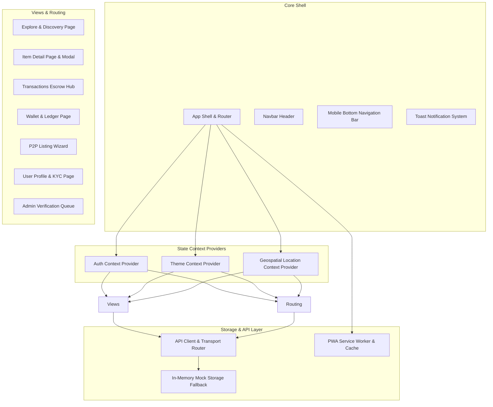

# Telos Frontend — Progressive Web Application

The user-facing Progressive Web Application (PWA) for the Telos Hyperlocal Peer-to-Peer Sharing Economy platform. Built with React 18, Vite, Tailwind CSS, Framer Motion, and Leaflet Spatial Mapping.

---

## Technical Architecture



---

## Directory Organization

| Path | Purpose |
| --- | --- |
| `src/api/client.js` | Universal API client with automatic Spring Boot HTTP connection and mock fallback router |
| `src/api/mockData.js` | Pre-seeded mock data for listings, transactions, wallet ledger entries, and categories |
| `src/components/common/` | Reusable UI components (Buttons, Modals, Badges, Date Pickers, Hero Banners) |
| `src/components/items/` | Item grid cards, category filters, bottom sheets, and detail modals |
| `src/components/map/` | Leaflet spatial map integration and location pin selection modals |
| `src/components/transactions/` | Transaction state steppers, escrow cards, and handoff action panels |
| `src/components/handoff/` | Cryptographic QR code generator and camera scanner modal components |
| `src/components/chat/` | Responsive direct messaging drawer component |
| `src/components/wallet/` | Financial overview cards, top-up modals, and ledger audit tables |
| `src/components/admin/` | Identity verification queue and receipt inspection panels |
| `src/context/` | Global React context state providers (Auth, Theme, Location, Toast) |
| `src/pages/` | Page view components mapped to React Router paths |

---

## Key Features

1. **Responsive Dual Viewport Layout**
   - **Desktop**: Split-screen view featuring item grid listings on the left and sticky interactive Leaflet spatial map on the right.
   - **Mobile**: Compact single-column design with view toggles (List, Map, Split) and sticky touch navigation bar.

2. **Indian Rupee (₹) Currency System**
   - All financial displays, daily rental rates, security deposits, wallet balances, and top-up presets (`₹250`, `₹500`, `₹1,000`, `₹2,500`) are formatted in Indian Rupees (₹).

3. **PWA Standalone Web App Installation**
   - Includes Web App Manifest (`public/manifest.json`) and Service Worker (`public/sw.js`) enabling native installation on iOS (Safari), Android (Chrome), and Desktop browsers.

4. **Dark & Light Mode Styling**
   - Native dark theme support powered by Tailwind CSS classes and class-based theme switching.

---

## Route Architecture

| Route Path | View Component | Access Control | Description |
| --- | --- | --- | --- |
| `/` | `ExplorePage` | Public | Main landing page with radial discovery map and search filters |
| `/explore` | `ExplorePage` | Public | Hyperlocal item catalog and map discovery view |
| `/item/:id` | `ItemDetailPage` | Public | Dedicated item detail view with date calculator and escrow request CTA |
| `/transactions` | `TransactionsPage` | Authenticated | Escrow status tracking, role tabs (Lender/Borrower), and QR handoffs |
| `/wallet` | `WalletPage` | Authenticated | Financial overview, payment top-ups, and ledger audit log |
| `/create-item` | `CreateItemPage` | Authenticated | 3-step item listing wizard with location pin picker |
| `/profile` | `ProfilePage` | Authenticated | User profile, trust rating badges, neighbor reviews, and KYC status |
| `/admin` | `AdminPage` | Admin Only | Identity verification queue and receipt inspection dashboard |
| `/login` | `LoginPage` | Public | Authentication page and persona switcher |

---

## Build & Development Commands

### Development Server
```bash
npm run dev
```
Starts the Vite development server at `http://localhost:5173`.

### Production Compilation
```bash
npm run build
```
Compiles production assets into the `dist/` directory.

### Production Preview
```bash
npm run preview
```
Serves the compiled production build locally for verification.
